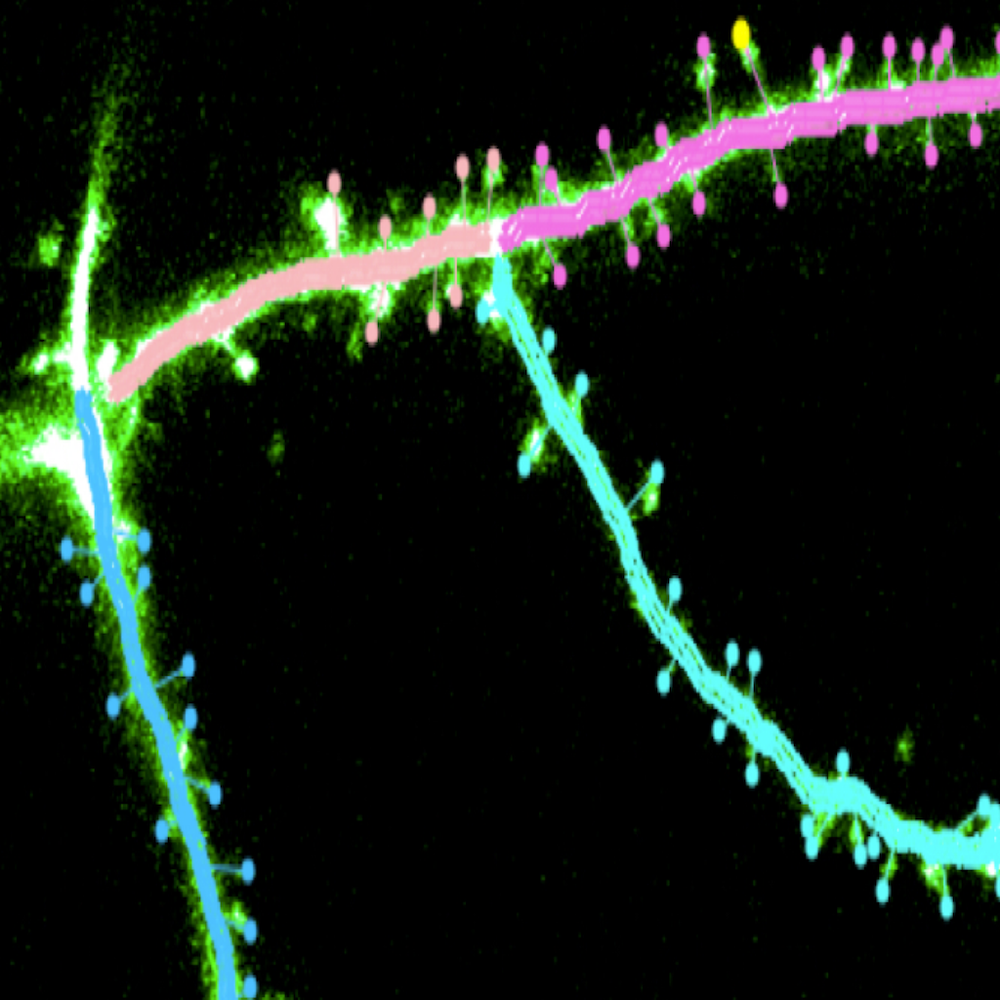

---
hide:
  - navigation
  - toc
---

  

    

      
      

        <h1>MapManager</h1>
        
Longitudinal dendritic spine analysis

      

    

    

      <a href="https://mapmanager.net/mapmanager-igor" class="btn btn-legacy btn-small" target="_blank">
        Legacy MapManager-Igor Documentation
      </a>
    

  

  

    

      <h2>Desktop Application</h2>
    

    

      <!-- Add description here -->
    

    

      

        <a href="https://github.com/mapmanager/PyMapManager/releases/latest/download/PyMapManager-macOS.dmg" class="btn btn-primary" target="_blank">
          <i class="fab fa-apple"></i> macOS
        </a>
        <a href="https://github.com/mapmanager/PyMapManager/releases/latest/download/PyMapManager-Windows.exe" class="btn btn-primary" target="_blank">
          <i class="fab fa-windows"></i> Windows
        </a>
      

      

        <a href="https://github.com/mapmanager/PyMapManager/releases" class="btn btn-secondary" target="_blank">
          <i class="fas fa-download"></i> All Downloads
        </a>
        <a href="getting-started/" class="btn btn-secondary">
          <i class="fas fa-book-open"></i> Getting Started
        </a>
      

    

  

  

    

      <h2>Web Application</h2>
    

    

      <!-- Add description here -->
    

    

      <a href="https://mapmanager.net/WebMapManager/" class="btn btn-primary" target="_blank">
        <i class="fas fa-globe"></i> Try Live Demo
      </a>
      <a href="getting-started/" class="btn btn-secondary">
        <i class="fas fa-book-open"></i> Getting Started
      </a>
    

  

  

    

      <h2>Core Backend</h2>
    

    

      An extensible Python computational backend with comprehensive API, notebooks, and scripting.
    

    

      <a href="https://github.com/mapmanager/MapManagerCore" class="btn btn-primary" target="_blank">
        <i class="fab fa-github"></i> View Repository
      </a>
    

  

  <h2>Why MapManager?</h2>
  

    

      <h3>🔬 Advanced Analysis</h3>
      
Sophisticated algorithms for dendritic spine analysis

    

    

      <h3>🖥️ Multiple Interfaces</h3>
      
Choose between desktop and web applications. Both powered by the same powerful MapManagerCore backend.

    

    

      <h3>⚡ WebAssembly Powered</h3>
      
Web version uses Pyodide for Python performance in the browser

    

    

      <h3>🔧 Developer Friendly</h3>
      
Open-source core with comprehensive API documentation

    

  

