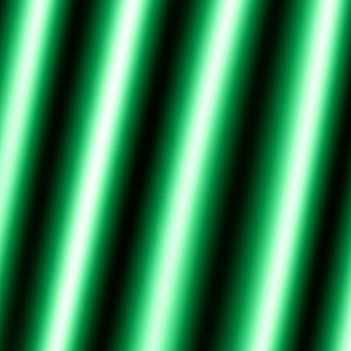
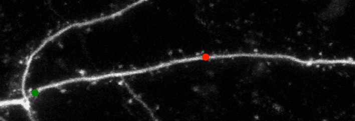
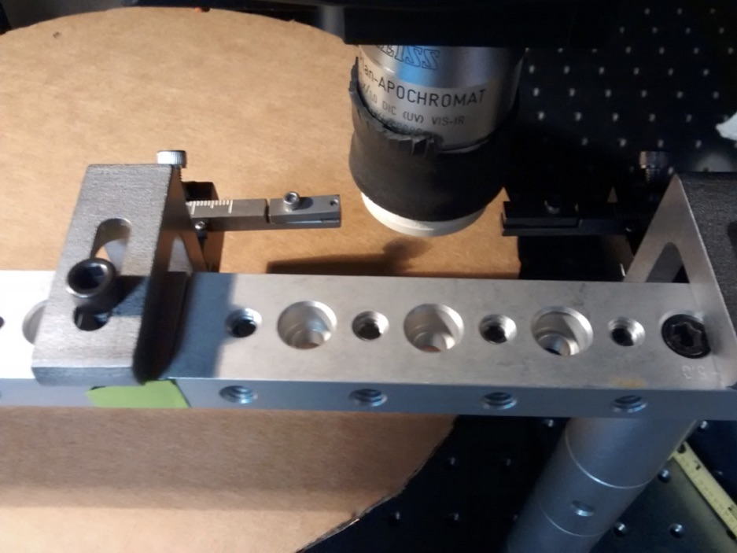
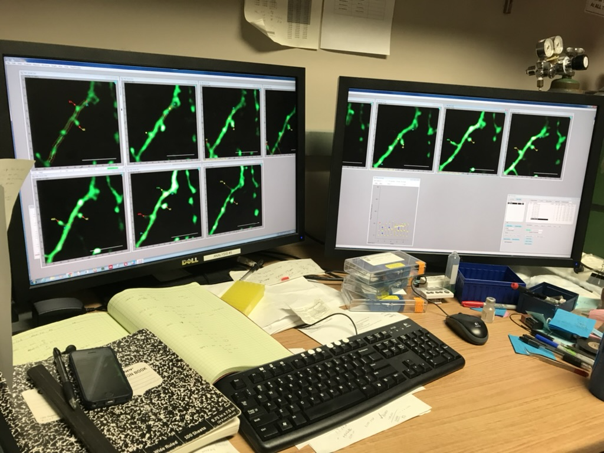

---
hide:
  - navigation
  - toc
---

# Robert H. Cudmore {.hero-title}

This is a collection of software projects I work on.

<strong>MapManager</strong>

<a href="https://mapmanager.github.io/WebMapManager/" class="md-button card-web-demo">Web Demo</a>

Longitudinal dendritic spine analysis with desktop, web, and Python backend.

[:octicons-mark-github-24: WebMapManager](https://github.com/mapmanager/WebMapManager){ .md-button }
[:octicons-mark-github-24: PyMapManager](https://github.com/mapmanager/PyMapManager){ .md-button }
[:octicons-mark-github-24: MapManagerCore](https://github.com/mapmanager/MapManagerCore){ .md-button }
[:octicons-book-24: Docs](https://mapmanager.github.io/){ .md-button }

<strong>Cloudscope</strong>

<a href="https://cloudscope.mapmanager.net/" class="md-button card-web-demo">Web Demo</a>

Image analysis for microscopy data with desktop, web, and scripting.

[:octicons-mark-github-24: GitHub](https://github.com/mapmanager/cloudscope){ .md-button }
[:octicons-book-24: Docs](https://mapmanager.github.io/cloudscope/){ .md-button }

<strong>SanPy</strong>

SanPy is software for whole-cell current clamp analysis.

[:octicons-mark-github-24: GitHub](https://github.com/cudmore/SanPy){ .md-button }
[:octicons-book-24: Docs](https://cudmore.github.io/SanPy/){ .md-button }

<strong>Brightest Path Lib</strong>

Path-finding algorithms to find the brightest path between points in an image.

[:octicons-mark-github-24: GitHub](https://github.com/mapmanager/brightest-path-lib){ .md-button }
[:octicons-book-24: Docs](https://mapmanager.github.io/brightest-path-lib/){ .md-button }
[:octicons-package-24: PyPI](https://pypi.org/project/brightest-path-lib/){ .md-button }

<strong>PiE</strong>

A Raspberry Pi Controlled Experiment (PiE).

[:octicons-mark-github-24: GitHub](https://github.com/cudmore/pie){ .md-button }
[:octicons-book-24: Docs](https://cudmore.github.io/pie-doc/){ .md-button }

<strong>MapManager - Igor</strong>

Original Igor Pro version of MapManager for longitudinal image analysis.

[:octicons-book-24: Docs](https://mapmanager.github.io/){ .md-button }

